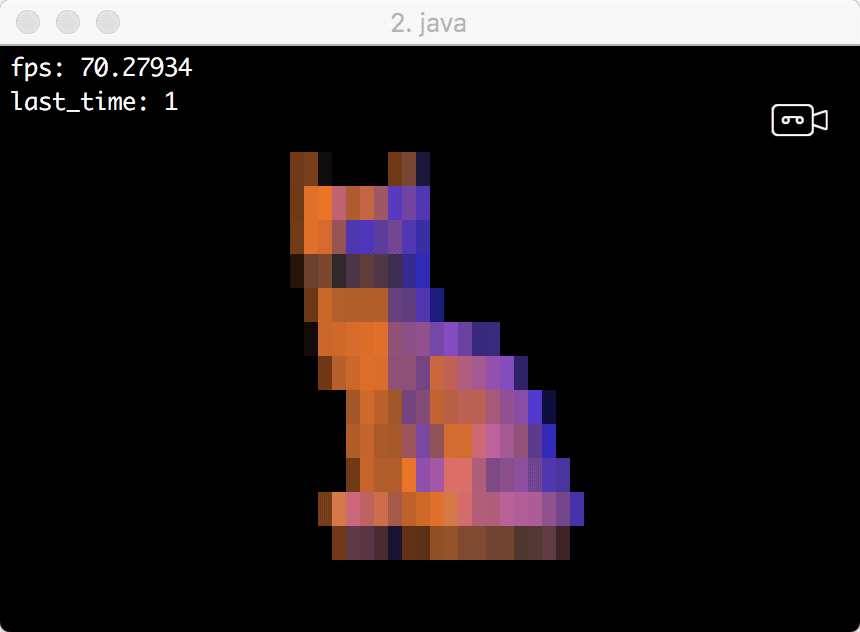
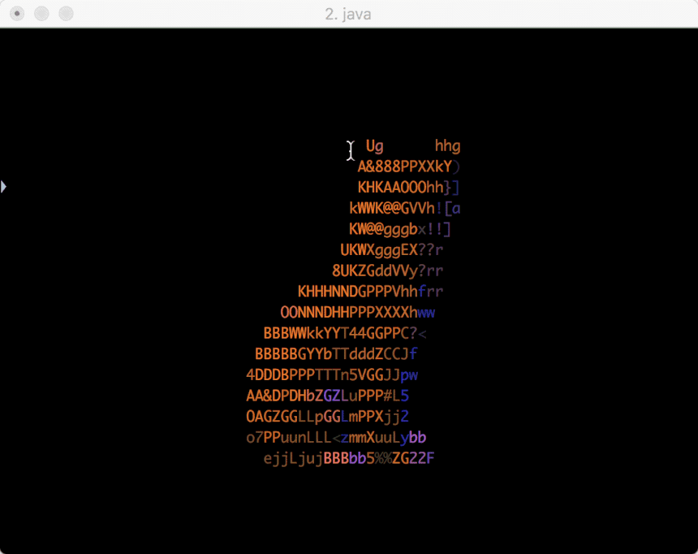
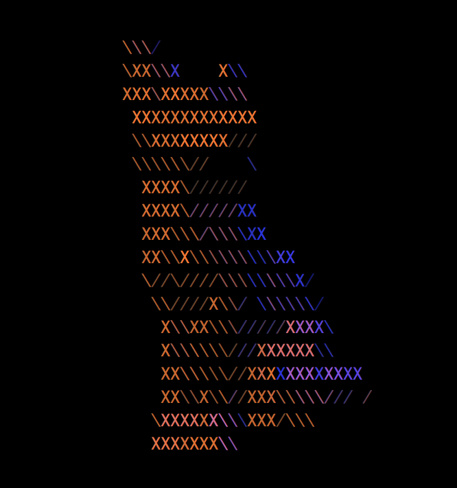

# P5 Terminal Graphics


## About
Experiment to use a terminal as the graphics output for a [procesing](www.processing.org) sketch.

(Only tested on OSX)







## Usage

You can not use this from the processing PDE cause the PDE cannot make use of an external console.

When using VSCode set in the user settings which terminal to use, I use iTerm:
`"terminal.external.osxExec": "iTerm.app",`

In `launch.json` set that you wan't to use a external terminal using `"console": "externalTerminal"`.
(If you downloaded this repository then it's already there).

When using size you can define the renderer:

```java
public void settings() {
    size(1120, 850, P5_Terminal_Graphics.TERMINAL);
}
```

See `Terminal_Fox.java` for a full implementation.

Keep in mind the library comes with an alpha of processing 4 which requires JDK 11. You can replace *lib/core.jar* with a version of processing 3 and things should still work.


### using println

Since there is no console for text output, all the output goes to two text files named `std_out.txt` and `std_err.txt`. Everytime you run the sketch again those files are recreated.
If you wan't to change the name of those files then you can set them using: 

```java
P5_Terminal_Graphics.std_out_file_name = "my_out_file.txt";
P5_Terminal_Graphics.std_err_file_name = "my_err_file.txt";
```

They will always be relative to the sketch folder.

### keyTyped

The methods `keyPressed` and `keyReleased` are not supported, since this is not possible. However, `keyTyped` does work but could use some love. Normal characters work and the up, left, up and down arrow. It is possible to add support for more keys, feel free to make a pull request

### changing style

At the moment to change colors etc. you can make changes in the `post` method inside `P5_Terminal_Graphics`. Ideally this would be exposed to the user in some other way but I didn't put any thought into that yet.

### changing the character set

The characters used can be changed using:
```java
P5_Terminal_Graphics.sequence = " /\\X";
```


This has to be done before `draw` is called, else it has no effect.
The order of the characters should be aranged from bright to dark.


## Known Issues

Check the issue page for open issues. There are some, but they are minor.
